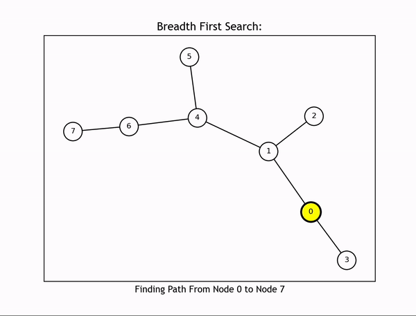
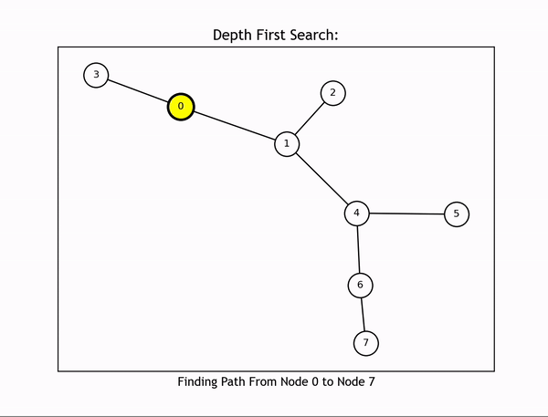
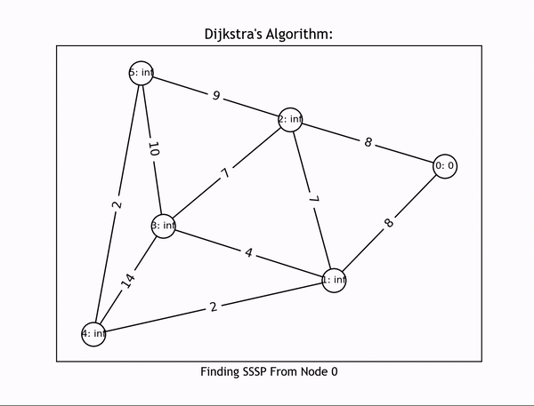
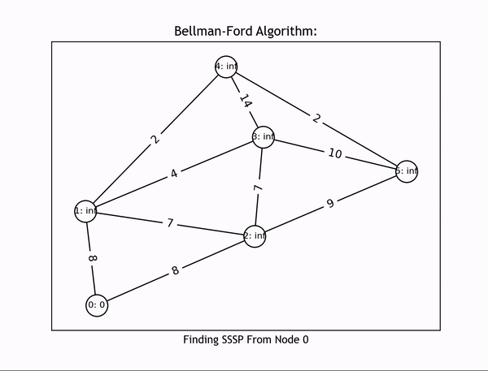
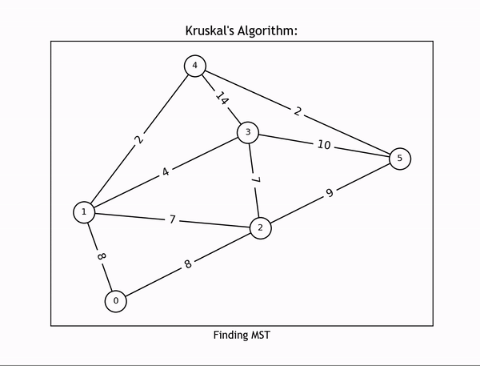
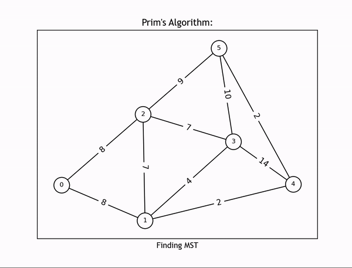

# Graph Algorithm Animations

## OVERVIEW

This Python program generates animations for graph algorithms. The program creates a graph, runs the algorithm on the graph, and animates the algorithm.

### SEARCHING ALGORITHMS

**Breadth First Search**



**Depth First Search**



### SINGLE SOURCE SHORTEST PATH ALGORITHMS

**Dijkstra's Algorithm**



**Bellman-Ford Algorithm**



### MINIMUM SPANNING TREE ALGORITHMS

**Kruskal's Algorithm**



**Prim's Algorithm**



## FEATURES
- n/a

## REQUIREMENTS

- [Matplotlib.pyplot](https://matplotlib.org/3.5.3/api/_as_gen/matplotlib.pyplot.html)
- [Matplotlib.animation](https://matplotlib.org/stable/api/animation_api.html)
- [NumPy](https://numpy.org)
- [NetworkX](https://networkx.org)
- [Logging](https://docs.python.org/3/library/logging.html)

## LIBRARIES / DEPENDENCIES

[**pipenv**](https://pipenv.pypa.io/en/latest/)
- **Python Environment Packaging Tool**: creates flexible environment manipulation and containment by storing various environments in a common directory.
- **Dependency Resolution**: various projects may need different tool versions. dependencies versions downloaded system wide are hard to change. pipenv creates separate environments to easily switch between environments.  
- **Benefits**: creating a modifiable environment between many different projects.

start virtual environment:  
```shell
pipenv shell
```
install dependencies:
```shell
pipenv install -r requirements.txt
```
freeze requirements:
```shell
pipenv requirements > requirements.txt
```
show packages:
```shell
pipenv graph
```

[**venv**](https://docs.python.org/3/library/venv.html)
- **Python Virtual Environment Tool**: creates isolated environments by creating a subdirectory with a custom, modifiable bin directory.
- **Virtual Environment**: contains project libraries and binaries (dependencies) to isolate project software from operating system installed libraries.
- **Benefits**: creating many different switchable and testable environments for one project.

start virtual environment:
```shell
python -m venv path/to/virtual/environment
```
install dependencies:
```shell
python -m pip install -r requirements.txt
```
activate virtual environment:
```shell
source path/to/virtual/environment/bin/activate
```
deactivate virtual environment:
```shell
deactivate
```
freeze requirements:
```shell
pip freeze > requirements.txt
```

[**Logging**](https://docs.python.org/3/howto/logging.html)
- python logging library, allows event tracking and output visibility

## TOOLS
- n/a

## CONCEPTS

### Searching Algorithms

- path between a starting node and destination node

**Breadth First Search**
- graph traversal searching algorithm
- uses a queue to search graphs breadth first

pseudocode: 
```pseudo
breadth_first_search(graph, starting_node, destination node) {

    let path be a list
    add starting_node to path

    let queue be a list
    add path to queue

    let visited be a list
    mark starting_node as visited

    while the queue is not empty {

        pop queue
        set path to the first entry in queue
        let current_node be the last node in path

        for each unvisited neighbor_node of current_node in graph {

            mark neighbor_node as visited
            let new_path be a copy of path
            add neighbor_node to new_path
            add new_path to queue

            if current_node is destination node {
                return path
            }

        }

    }

    return path not found

}
```

**Depth First Search**
- graph traversal searching algorithm
- uses a stack to search graphs depth first

pseudocode: 
```pseudo
breadth_first_search(graph, starting_node, destination node) {

    let path be a list
    add starting_node to path

    let stack be a list
    add path to stack

    let visited be a list
    mark starting_node as visited

    while stack not empty {

        set path to the last entry in stack
        let current_node be the last node in path

        if an unvisited neighbor_node of current node exists in graph {

            mark neighbor_node as visited
            let new_path be a copy of path
            add neighbor_node to new_path
            add new_path to queue

            if current_node is destination node {
                return path
            }

        } else {
            pop stack
        }

    }

    return path not found

}
```

### Single Source Shortest Path Algorithms

- path containing the shortest paths to all nodes in the graph from a starting node

**Dijkstra's Algorithm**
- graph algorithm to find the SSSP
- must run on a weighted, connected graph with no negative edge weights
- greedy algorithm

pseudocode:
```pseudo
dijkstras(graph, starting_node) {

    let sssp be a list
    let distances be a dict
    assign 0 to distances at the starting_node
    assign infinity to distances at all other nodes

    while sssp doesn't include all nodes {

        let minimum_distance_node be a node not in sssp with the minimum distance from sssp
        update distances of all adjacent vertices to be the distance from the source to the adjacent vertex

    }

    return SSSP

}
```

**Bellman-Ford Algorithm**
- graph algorithm to find the SSSP
- must run on a weighted, connected graph with no negative edge cycles
- dynamic programming algorithm

pseudocode:
```pseudo
bellman-ford(graph, starting_node) {

    let sssp be a list
    let distances be a dict
    assign 0 to distances at the starting_node
    assign infinity to distances at all other nodes

    for num_nodes iterations {

        for each edge in graph {

            update distances of all vertices to be the min(distance stored at vertex, distance of edge + distance stored at vertex)

            in the last iteration, if the distance from the sssp node to the adjacent vertex is less than the distance stored at vertex, a negative cycle exists

        }

    }

    return SSSP

}
```

### SINGLE SOURCE SHORTEST PATH ALGORITHMS

- subset of edges, containing no cycles, that connects all vertices of a graph with the smallest possible total weight 

**Kruskal's Algorithm**
- graph algorithm to find the MST
- must run on a weighted, connected, undirected graph
- greedy algorithm

```pseudo
kruskals(graph) {

    let mst be a list of edges
    let edges be a list of edges sorted increasingly by weight

    while mst doesn't include num_nodes - 1 edges and for each edge in edges {

        if the edge forms a cycle {

            discard the edge

        } else {

            add edge to mst

        }

    }

}
```

**Prim's Algorithm**
- graph algorithm to find the MST
- must run on a weighted, connected, undirected graph
- greedy algorithm

```pseudo
prims(graph) {

    let node be an arbitrary node in the graph

    while mst doesn't include all nodes {

        let minimum_edge be an edge with minimum edge weight

        while minimum_edge forms a cycle {

            set minimum_edge to be the next smallest weight edge

        }

        add minimum_edge to mst

    }

}
```

### MAXIMUM FLOW ALGORITHMS

- maximum amount of flow from a source node to a sink or destination node through a directed graph

**Ford-Fulkerson Algorithm**

- graph algorithm to find the maximum flow
- must run on a weighted, connected, directed graph

```pseudo
```

### UTILITY ALGORITHMS

**Union Find Algorithm**
- algorithm used to detect cycles in graphs
- logic:
    - assumes each pair of nodes is contained in a separate set or tree of nodes
    - each set of nodes has a representative node or highest level parent node
    - find: finds the representative node of node
    - union: joins the set of nodes under one representative node
- if two sets of nodes have the same representative node, a cycle exists

```pseudo
find(node, representatives) {

    let representatives be an existing list of each nodes representative nodes

    if node representative is the same as node {

        return node

    }

    let parent be find(node representative), recursively call find to find the representative of the set
    set representative at node to parent
    return parent

}

union(node_one, node_two, representatives) {

    let representatives be an existing list of each nodes representative nodes

    let node_one_representative be the representative of node_one
    let node_two_representative be the representative of node_two

    union node_one and node_two sets, set representatives at node_two_representative to be node_one_representative

}
```

## SOURCES

- [Matplotlib animations](https://matplotlib.org/stable/users/explain/animations/animations.html)